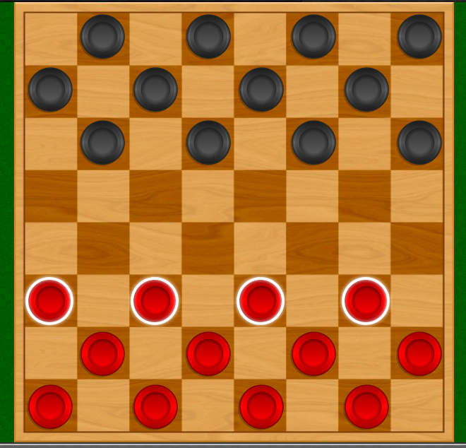

# ECE180-Assignment4
Last assignment for 180a -- a whole new way of looking at code design

## Let's Play Checkers

### Rules of the Game

Checkers is a two-person board game played on an 8x8 game board (same as chess board). Each player places their 12 pieces (usually red vs black) on the board on alternating dark squares in the three rows nearest to themselves. (See the following picture).

- At the start of the game, all pieces are "pawns", and can only move forward by 1 diagonal space at a time (on dark squares) toward the opponent's side of the board.
- If a piece player's piece is directly adjacent to an opponent's piece, it _may_ be able to "capture" the opponent's piece by jumping. 
- A pawn can only jump an opponent's piece when they are adjacent on a diagonal line, and the following space in the forward direction is unoccupied. Only one piece can be captured in a single jump; however, multiple jumps are allowed during a single turn, provided the condition of adjacency is met.
- Any time a move exists on the board where an opponent's piece can be captured, the player is required to jump and capture the piece.  
- Captured pieces must be removed from the board.
- When a piece reaches the furthest row away from the player who controls that piece, it is "crowned" and becomes a King. One of the pieces that have already been removed is stacked on the Pawn, indicating it is now a King. (Kings are twice as tall as Pawns).
- Unlike Pawns which may only move forward, Kings may move forward or backward (toward the controlling player) along the diagonal.
- Also unlike Pawns, a King may jump other players in either a forward or backward direction, in any combination.

### Your Challenge

So far, all of your programming assignments have involved building classes that collectively solve a given problem. This assignment is a little different, because your solution must "plug-in" to an existing framework. Framework-oriented solutions are commonplace in the professional world, and you'll surely encounter many of them during your career. In a framework-oriented solution, the _framework_ is responsible for overall control of the process, and your code plugs into the framework to help make decisions as necessary.

In this challenge, you will implement a "checker-bot" class that competes in a game of Checkers. During the course of play, your checker-bot will be given alternating "turns" to move any available game piece on the board. Gameplay will continue until a terminal condition occurs:

1. A checker-bot wins the game according to the normal rules of the game (see above)
2. A checker-bot forfeits the game by making an illegal move, or when it's detected trying to cheat 
3. A checker-bot takes too long to decide which move to make

#### Hey, This sounds HARD -- this isn't an AI class!

Yeah, you're right, we haven't taught you any AI techniques. So your checker-bot is NOT required to use any form of machine learning, neural-net, or any other technique found in the AI playbook. Still, a clever algorithm and well-chosen data structure can help considering in accomplishing your task. Note: for those of you so inclined, we won't mind if you build your own AI algorithms to solve this problem. Who knows, you may even invent a cool new technique. :)

In order to successfully complete this challenge -- your checker-bot must, at a minimum, correctly apply the rules of the game, and successively choose a valid piece, and indicate a valid move within the per-turn time limit. A trivial solution would merely move the first available piece to a valid destination. You won't likely win, but your checker-bot will meet the minimum requirements. 

Just so you don't panic -- it's been shown that a trivial (and rather dumb) implementation of the SFPlayer class can be written in under 80 lines of code. Most of the code involves determining which of your pieces can be moved or perform a jump (if required), and the possible board location destination(s) where the piece will come to rest.

### Implementation Details

1. You will build a subclass of SFPlayer. 
2. In the main.cpp file (provided), you create an instance of your player, and pass it to the `SFGame->run()` method.
3. Your checker-bot will be called alternatively against an opponent (during your testing, you'll compete against yourself)
4. Your checker-bot will decide what to do, and tell the game engine your decision by calling `move()` or `jump()`.

During each of your turns, your `SFPlayer::takeTurn(SFGame &aGame)` method will be called. You will have a limited amount of time to identify and indicate your move decision.  Note: the `SFBoard` object you gain access to is read-only. It is only a representation of the current state of the game. While we appreciate the hacker ethic and acknowledge the joy of defeating a dumb game engine, any checker-bot caught trying to cheat will be dealt with approprirately. Most likely, the checker-bot will be forced to work eternally as embedded code at a Jack-in-the-Box restaurant drive-through window. In other words, if your checker-bot intends to cheat, make sure it does _not_ get caught.

#### Examining the gameboard

The `SFGame` object is passed to your `SFPlayer.takeTurn()` method call. You can retrieve the current gameboard (`SFBoard`) by calling the `SFGame.getBoard()` method. The board is stored as a grid of 8 rows (numbered 0-7) and 8 columns (labeled 'A'-'H').

You may be wondering, once you've examined the gameboard, how do you choose a move, given a set of possible moves?

#### The Neighborhood Function

A _neighbourhood function_ is a function that returns colection of the states that are considered 'adjacent' to your current state. An adjacent state can be obtained by making a single modification to the current state according to whatever rules are appropriate to your problem. So, for example, given any Pawn on the gameboard, it can move only two directions : forward left, or forward right (because Pawns only move forward, and all moves are diagonal). In theory you generally have two options, until you consider that your piece may be blocked from going one or both of those directions. 

As a simple algorithm to find options for your next move, your neighborhood function might do the following: 

1. For each piece, make a list of all possible moves (forward-left, forward-right, jump-left, jump-right, etc.)
2. Eliminate any non-viable option according to game rules. For example, a Pawn _can_ move left, but may be blocked and therefore this option would be eliminated. 

Now you have a ist of possible choices. But which choice is best?

#### The Objective Function

An objective function indicates how 'close' a given option is to the optimal result. Sometimes your objective function knows exactly which is best, but it often just uses an approximation.

For example, consider the case where you have two Pawns that can move forward by 1 square. In a sense, these options appear to have exactly the same value. But what if one of your Pawns is only a square away from the back row of your opponent, where it can become a King. In this case, moving that piece produces a result of higher value to the outcome of your game (since Kings are more flexible and thus a much greater threat than Pawns). Between these two move options, the "move to become a King" has greater value, and is therefore ranked higher by your objective function.

#### Indicating your decision

After considering all your available options for each of your remaining pieces, and optimizing the options according to the "value" of the outcome as determined by your objective function, you'll either have one "best" option, or multiple "equally good" moves. If you have a single "best" move, take it. Otherwise, either of the "good" moves will be fine. Note: In a future lecture, we'll discuss a predictive technique that can produce additional information to help prioritize moves of currently equal value. 

After careful evaluation of the current state of the gameboard, your checker-bot is required to indicate a decision. You can:

1. move() -- moving your piece from a starting location on the board to a new destination location
2. jump() -- jumping your piece from a starting location on the board to 1, 2, or 3 destination locations

If you are moving a piece, it is essential that you are moving a valid piece to a legally avalable location. If either condition is not met (and you get caught trying to cheat), your checker-bot will forfeit the game. 

If you are jumping an opponent's piece, it is essential that you are moving a valid piece, that you are legally jumping an adjacent piece of your opponent, and that you are landing on a legally available location.  You'll notice that the `SFGame` offers multiple versions of the `jump()` method is case you are capable of making more than a single jump.

To indicate your move, you will call the `SFGame.move` or a variation of `SFGame.jump` within the allotted timeframe.

#### Testing your solution

During testing, your checker-bot will be playing against another instance by default. If you like, you can create a second checker-bot that utilizes a different strategy and test against that. This approach may help you optimize your move decision algorithm.

#### Getting help

Use Piazza. Come to office hours. Join us in the morning Dojo. 

### Submitting your work - Due March 15, 11:15pm (PST)

As usual, you must do your own work, and you cannot use code or libraries provided by anyone else, so no peeking on stackoverflow.  However, you MAY use any of the standard C++ (STL) libraries, like vectors, lists, maps, and so on.  You may of course discuss your solution with other students, TA, teachers, Uber drivers, Baristas, bartenders, athletes, librarians, aliens, family pets, or other-worldly spirits. 

Vlad-the-compiler is eagerly awaiting your submission, and is eager to meet your checker-bot in person.

#### Grading

Grading will follow the usual process. Vlad-the-compiler will make and run your solution, and do validation:

1. Your solution must compile (using make) and run without crashing - 70pts
2. Your solution always chooses a valid piece and a valid move/jump destination - 10pts
3. Your solution doesn't violate the rules of the game, such as the move/jump rule - 10pts
4. Your solution attempts to optimize the piece/destination phase to make a "better" choice amongst alternatives - 10pts

### Did we mention the prizes?

In addition to earning a grade, we're also offering two prizes for this assignment (with no bearing on the grade):

#### Winning Checker-Bot
All the checker-bots will be automatically entered into our 1st Annual Checker-bot Tournament. The tournament will follow the normal single-elimination process against all the other student submissions. Each match will be conducted on a best-out-of-5 series. The student who submits the winning checker-bot will win the coveted, "Ultimate Nerd" award (with a $10 amazon gift card). Their name shall be enscribed on the wall of "Moderately-embarrassed" winners for future generations to gaze upon with bemusement.

#### Most Cleverist Solution
After reviewing the student submissions, your judging panel will discuss the most interesting, promising, and downright evil solutions we find. If (and only if) a submission is determined to be more cleverer than all the others, we will (optionally) award the "Kermit-the-Frog" award for late-night hacking (also with a $10 amazon gift card). 

